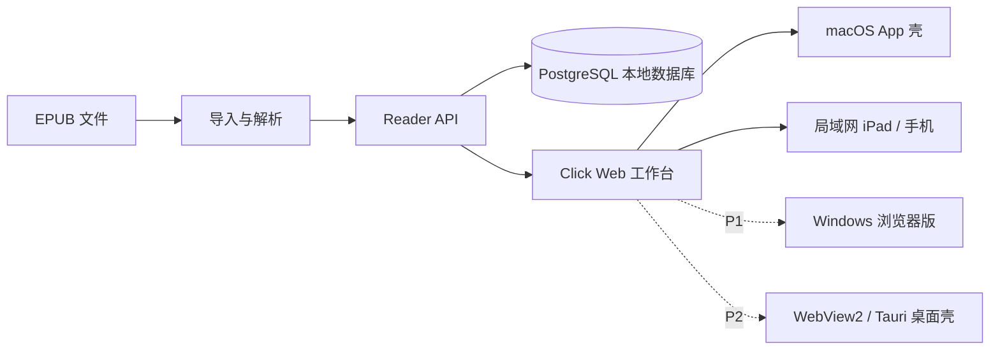

<h1 align="center">Click</h1>

<p align="center">
  <strong>一句话就是一个操作对象。</strong>
</p>

Click 是一个本地优先的精读系统。它不是普通电子书阅读器，重点不是把书翻过去，而是在阅读时用最短动作沉淀句子、笔记、红标、单词和复习材料。

当前产品以 macOS 为主，局域网网页端可以在 iPad 或手机浏览器里使用。Windows 不是不能做，但应该按层拆开适配，不能把 macOS 原生壳硬搬过去。

## 先记住这几个动作

Mac 阅读时，最重要的交互只有几件事：

| 动作 | 手势 |
| --- | --- |
| 添加文字备注 | 快速双击句子 |
| 添加语音备注 | 打开备注后使用语音转文字 |
| 整句标红 / 取消标红 | 双指点按句子 |
| 查看已有备注 | 单击有备注的句子 |
| 查英文词 | 单击英文单词 |
| 复制文字 | 拖选后按 `Command+C` |

iPad 或浏览器阅读时：

| 动作 | 手势 |
| --- | --- |
| 打开句子操作栏 | 点击句子 |
| 添加文字备注 | 点击句子后点 `笔记` |
| 添加语音备注 | 点击句子后点 `语音` |
| 整句标红 / 取消标红 | 点击句子后点 `红标` |
| 查英文词 | 点击英文单词 |
| 翻页 | 左右滑动 |

双击必须是快速连续两下。慢慢点两次只会被当成两次单击。

## 怎么添加备注

Mac：

1. 在正文里找到要记录的句子。
2. 快速双击这句话，打开备注窗口。
3. 输入文字，或使用语音转文字。
4. 保存后，这条备注会绑定到这句话。
5. 以后单击这句话，可以重新看到备注。

iPad / 浏览器：

1. 点击句子，打开底部句子操作栏。
2. 点 `笔记` 添加文字备注，或点 `语音` 添加语音备注。
3. 保存后，备注会绑定到这句话。

## 它解决什么

Apple Books 适合读书，但不适合高频精读。Click 解决的核心问题是：读到一句有价值的话时，能不能立刻把判断留下来。

| 阅读动作 | Click 的设计 |
| --- | --- |
| 添加文字备注 | 快速双击句子，直接记录文字备注 |
| 添加语音备注 | 在备注里说话，转成文字后绑定到这句话 |
| 整句标红 | Mac 双指点按句子，整句话标红或取消标红 |
| 回看备注 | 单击有备注的句子，直接看到之前写下的内容 |
| 本地沉淀 | 备注、红标、阅读位置保存到本机，不因为重启丢失 |

## 第一屏能力

Click 的首页不是装饰页，而是工作台：

| 区域 | 作用 |
| --- | --- |
| 继续阅读 | 直接回到上次阅读位置 |
| 最近阅读 | 用封面、进度、笔记数、红标数快速判断书的状态 |
| 最近沉淀 | 把刚写下的笔记和红标拉回视野 |
| 书库导航 | 按收藏、作者、分类、单词、笔记、红标进入不同工作流 |
| 批量整理 | 对多本书统一收藏、分类、隐藏或恢复 |

## 核心交互

### Mac

| 你想做什么 | 怎么操作 | 结果 |
| --- | --- | --- |
| 聚焦一句话 | 单击句子 | 当前句子高亮聚焦 |
| 查英文词 | 单击英文单词 | 弹出词义 |
| 添加文字备注 | 快速双击句子 | 打开备注窗口 |
| 添加语音备注 | 在备注窗口使用语音 | 转成文字后保存到这句话 |
| 看已有备注 | 单击有备注的句子 | 显示这句话的备注 |
| 整句标红 | 双指点按句子 | 整句话变红或取消红标 |
| 复制文字 | 拖选文字后按 `Command+C` | 复制选中文本 |
| 关闭弹窗 | `Esc` | 关闭备注、查词或抽屉 |

双击必须是快速连续两下。慢慢点两次会被当成两次单击。

### iPad / 浏览器

| 你想做什么 | 怎么操作 | 结果 |
| --- | --- | --- |
| 操作一句话 | 点击句子 | 底部出现句子操作栏 |
| 查英文词 | 点击英文单词 | 弹出词义 |
| 添加文字备注 | 点击句子后点 `笔记` | 打开备注 |
| 添加语音备注 | 点击句子后点 `语音` | 录音或降级为手动备注 |
| 整句标红 | 点击句子后点 `红标` | 整句话变红或取消红标 |
| 翻页 | 左右滑动 | 上一页或下一页 |
| 调整字体 | 点 `Aa` | 调整字号、行高、边距 |

桌面浏览器 / 未来 Windows 桌面壳复用同一套 Web 阅读器键盘层：

| 你想做什么 | 快捷键 |
| --- | --- |
| 聚焦后添加备注 | `N` |
| 聚焦后整句标红 / 取消标红 | `R` |
| 聚焦后添加语音备注 | `V` |
| 关闭弹窗或取消聚焦 | `Esc` |
| 翻页 | 方向键 / `PageUp` / `PageDown` |

## 书库组织

Click 的书库整理不是“把书堆起来”，而是为后续学习服务。

| 组织方式 | 当前状态 |
| --- | --- |
| 收藏 | 支持单本收藏和批量收藏 |
| 作者 | 首页统计和作者分组 |
| 自定义分类 | 支持单本分类和批量分类 |
| 标签 | 书籍详情里维护标签 |
| 隐藏 / 恢复 | 非破坏式移除，避免误删书籍数据 |
| 笔记 / 红标 | 可以按书回到原文 |
| 单词本 | 书内词汇可以进入主动复习 |

## 平台支持

Click 是一套本地优先阅读系统，不是为每个平台重写一套阅读器。不同平台共享 Reader API、PostgreSQL 数据底座、EPUB 导入、句子、备注、红标和查词逻辑。

更完整的平台状态说明见 [`docs/platform_status.md`](docs/platform_status.md)。移动端 App 壳路线见 [`docs/mobile_app_shell_plan.md`](docs/mobile_app_shell_plan.md)。

| 平台 | 当前状态 | 入口 |
| --- | --- | --- |
| macOS App | 当前主力可用 | 打开 Click App |
| iPad / 浏览器 | 当前可用 | 同一局域网访问 `/library` 或 `/lan/reader` |
| Windows 浏览器版 | 计划优先支持 | Windows 本机运行 Reader API 后，用浏览器打开 `/library` |
| Windows 桌面版 | 后续规划 | 用 WebView2 或 Tauri 包一层 `Click.exe` 桌面壳 |
| Windows 快捷键 | Web 层已实现基础键盘契约 | 未来 Windows 浏览器版和桌面壳复用 `N` / `R` / `V` / `Esc` / 方向键 |

Windows 不重写阅读器，优先复用 Reader API、Web 主界面和 Web 阅读器。Windows 浏览器版和 Windows 桌面版不是当前已完成能力，属于后续平台路线。

## 系统形态



核心判断：阅读数据、解析逻辑和 Web 工作台应该跨平台；macOS 外壳、系统菜单、权限、打包签名不应该跨平台硬搬。

## Windows 路线

现在没有可下载的 Windows 版本。可行路线是先浏览器版，再桌面壳，最后才考虑安装包产品化。

| 阶段 | 判断 | 做法 |
| --- | --- | --- |
| P1 | 最值得先做 | Windows 本机运行 Reader API，用浏览器打开 `http://localhost:18180/library` |
| P2 | 可产品化 | 用 WebView2 或 Tauri 做 `Click.exe`，自动启动 Reader API 并打开 `/library`，复用 Web 快捷键 |
| P3 | 发行阶段 | 做安装包、开始菜单快捷方式、可选桌面快捷方式、启动诊断和卸载逻辑；这部分尚未完成 |

可复用部分：

- `reader_api` 的 FastAPI 服务
- EPUB 导入、句子、笔记、红标、单词数据模型
- PostgreSQL schema 和迁移脚本
- Web 主界面和 Web 阅读器

需要重做或改造的部分：

- Swift / macOS App 壳
- WebKit 与 macOS 菜单交互
- macOS 权限、文件导入、打开方式绑定
- 语音识别要走 Click 软件层本地识别优先，系统语音识别只能作为备选
- macOS 打包、签名和 LaunchServices 行为

结论很直接：Windows 不要先承诺“原生完整复刻”。第一步应该做 Windows 浏览器版，把阅读工作台跑起来；第二步再考虑 WebView2 / Tauri 桌面壳。

## 当前边界

当前版本适合在开发机和同一局域网内使用，还不是最终公开发行版。

- 还没有正式签名安装包
- 还不是原生 iPad App
- 还没有云同步
- 还不适合公网访问
- PDF 不是当前重点
- 部分本地目录仍沿用历史兼容路径，这是为了不破坏已有数据

## 本地数据

Click 是本地优先软件。你的真实书籍、阅读位置、笔记、红标、查词记录和导出记录保存在本机数据库与本地应用目录里。

结构化数据使用 PostgreSQL：

```text
database: sentence_reader
schema: reader
```

局域网入口：

```text
http://<Mac 局域网 IP>:18180/library
http://<Mac 局域网 IP>:18180/lan/reader
```

## 从源码验证

常用验收命令：

```bash
./scripts/v1_acceptance.sh
./scripts/v21_ipad_lan_acceptance.sh
.venv-reader-api/bin/python -m pytest tests/test_reader_api_mock.py
.venv-reader-api/bin/python -m compileall reader_api scripts tests
python3 scripts/package_sentence_reader_app.py
python3 scripts/public_repo_privacy_smoke.py
python3 scripts/public_readme_platform_smoke.py
```

前端静态冒烟：

```bash
.venv-reader-api/bin/python scripts/sentence_reader_library_ui_static_smoke.py
.venv-reader-api/bin/python scripts/reader_api_static_smoke.py
```

## 不进入 GitHub 的内容

为了避免仓库臃肿和泄露私人数据，GitHub 不包含：

- 真实书籍
- 本地数据库
- 完整词库 CSV
- 打包后的 App
- Python 虚拟环境
- 构建缓存
- 运行报告
- 真实界面截图
- 书籍封面或阅读内容图片

GitHub 只保存源码、文档、迁移脚本和小型测试样本。

## 文档入口

- [使用说明](docs/user_guide.md)
- [产品验收标准](docs/product_acceptance.md)
- [当前状态](docs/current_status.md)
- [产品路线图](docs/product_roadmap.md)
- [交互规则](docs/interaction_contract.md)
- [运行环境与可迁移性](docs/runtime_portability.md)
- [Windows 客户端方案](docs/windows_client_plan.md)

## 产品原则

```text
读书动作要短
句子操作要快
数据要本地可靠
AI 和在线服务只能增强，不能成为地基
```
