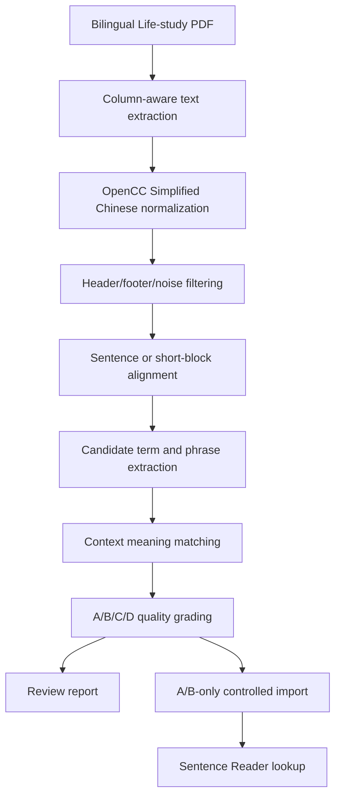

# Life-study Context Vocabulary Pipeline Plan

Updated: 2026-06-29

## Decision

The Life-study vocabulary feature must be treated as an accuracy-gated extraction pipeline, not a bulk dictionary import.

The first probe proved that the bilingual PDF can be parsed, but it also proved that direct candidate generation is not good enough for production. On the Genesis bilingual PDF first 20 pages, the probe produced:

- 912 bilingual line pairs
- 160 text units
- 120 vocabulary candidates
- 17 confirmed candidates
- 103 candidates needing review

That is good enough to continue the technical path, but not good enough to write a formal glossary into the app.

## Product Goal

When the user taps or clicks an English word or phrase in Sentence Reader, the first explanation should be the meaning in the book's own Chinese context, especially for ministry terms whose meaning differs from ordinary dictionary usage.

Examples:

- `economy` should prefer `经纶` in the right context, not generic `经济`.
- `dispensing` should prefer `分赐` in the right context.
- `divine life` should prefer `神圣的生命`.

The glossary must remain evidence-backed. A term is not trusted unless it can point back to an aligned English sentence or phrase and the matching Chinese context.

## Non-Negotiable Rules

1. Do not run the full Life-study corpus before Genesis passes the quality gate.
2. Do not write low-confidence candidates into the production lookup path.
3. Do not let AI invent meanings that are not supported by the aligned Chinese text.
4. Do not show review-grade candidates in the reader UI.
5. Do not treat common single words such as `god`, `life`, `word`, or `earth` as automatically valid glossary entries.
6. Do not pollute the general dictionary with Life-study-specific meanings.
7. Do not overwrite user-corrected meanings.

## Data Source Strategy

Primary source:

- Bilingual Life-study PDFs, because they already contain English and Chinese on the same page and preserve the intended translation context.

Secondary source:

- Separate English and Chinese EPUB/MOBI/PDF files can be used only as fallback or cross-check material.

Current probe source:

- `01_Genesis(120).pdf`

Current probe output:

- `reports/lifestudy_vocab_probe/01_Genesis-120-pages-1-20-probe.json`
- `reports/lifestudy_vocab_probe/01_Genesis-120-pages-1-20-vocab.csv`

## Pipeline V1



## Quality Grades

| Grade | Meaning | UI visibility | Database action |
| --- | --- | --- | --- |
| A | Strong exact or near-exact bilingual evidence | Can show in reader | Can import |
| B | Good contextual evidence, minor normalization uncertainty | Can show with source/confidence | Can import with provenance |
| C | Plausible but needs review | Hidden from reader | Review report only |
| D | Noise or misleading candidate | Hidden from reader | Discard |

## Matching Rules

### A Grade

A term can be A grade only when:

- the English candidate appears in a high-confidence aligned unit
- the Chinese meaning appears in the paired Chinese unit
- the candidate is not a page header, title artifact, duplicated n-gram, or generic single word
- simplified Chinese normalization is clean
- evidence can be shown without relying on model invention

### B Grade

A term can be B grade when:

- the aligned unit is reliable
- the Chinese meaning is strongly implied by a nearby phrase
- the candidate appears multiple times with the same Chinese expression
- minor punctuation or morphology differences exist

### C Grade

A candidate is C grade when:

- the English term is meaningful, but the Chinese expression is not isolated enough
- the alignment is paragraph-level rather than sentence-level
- the candidate may be useful but needs human review

### D Grade

A candidate is D grade when it is a broken n-gram or noise, such as:

- repeated fragments like `god god` or `earth earth`
- grammar fragments like `says god`
- overly broad terms like `book`, `chapter`, or `created` without a domain phrase
- page headers and running titles

## Implementation Tasks

| Step | Input | Action | Output | Acceptance |
| --- | --- | --- | --- | --- |
| 1. OpenCC integration | bilingual PDF text | Replace probe-only traditional-to-simplified fallback with OpenCC or a pinned equivalent | clean simplified Chinese text | no obvious traditional Chinese remains in top evidence |
| 2. Noise filtering | extracted lines | Remove page headers, footers, page numbers, repeated book titles, malformed line fragments | cleaner bilingual units | top 100 candidates contain no header-only terms |
| 3. Sentence alignment | bilingual line pairs | Split English and Chinese into sentence/short-block units and score alignment | aligned units with confidence | at least 85% of sampled units are visually correct |
| 4. Candidate extraction | aligned units | Extract domain phrases, noun phrases, hyphenated terms, and useful single words | raw candidates | broken n-grams are reduced before scoring |
| 5. Context matching | candidates + Chinese units | Match candidate to Chinese expression using exact phrase maps, repeated bilingual evidence, morphology, and conservative rules | candidate meanings | A/B entries must have evidence and reason |
| 6. Quality grading | matched candidates | Assign A/B/C/D with numeric score and reason | reviewable JSON/CSV | C/D never enter reader lookup |
| 7. Genesis gate | Genesis first 50 pages | Run pipeline and sample-check A/B entries | quality report | A/B precision target >= 85%; hard fail below 80% |
| 8. Genesis full run | full Genesis bilingual PDF | Run only after first 50 pages pass | Genesis glossary candidate pack | top 200 A/B sample precision >= 85% |
| 9. Controlled import | A/B glossary pack | Import into a Life-study domain glossary table or staging table | production-readable glossary | no overwrite of user corrections or general dictionary |
| 10. Reader lookup integration | local glossary + dictionary | Lookup order becomes user correction > book context > Life-study glossary > local dictionary > optional online lookup | reader result | UI shows source and confidence |

## Database Boundary

Life-study meanings should not be mixed into `reader.dictionary_entries` as generic definitions.

Preferred production shape:

- keep `reader.dictionary_entries` for general dictionary meanings
- keep `reader.book_vocab_items` for book-specific and user-facing vocabulary items
- use the dedicated Life-study/domain glossary boundary `reader.domain_glossary_entries`

The Genesis quality gate has passed, so `migrations/reader/006_lifestudy_domain_glossary.sql` is now the accepted domain boundary. Reports still remain the source of review evidence; C/D candidates stay outside PostgreSQL.

## Reader Lookup Order

The reader should resolve a lookup in this order:

1. User-corrected meaning
2. Current book context meaning
3. Life-study domain glossary, if confidence is A/B
4. General local dictionary
5. Optional online lookup

The UI should show the source, for example:

- `本书语境`
- `生命读经词库`
- `本地词典`
- `在线查询`

## Current Status

The original script remains as a probe:

- `scripts/lifestudy_bilingual_vocab_probe.py`

The V1 accuracy-gated pipeline is now implemented:

- `scripts/lifestudy_context_vocab_pipeline.py`
- `scripts/lifestudy_context_vocab_pipeline_smoke.py`
- `scripts/lifestudy_context_vocab_import.py`
- `scripts/lifestudy_context_vocab_import_smoke.py`
- `scripts/lifestudy_context_vocab_domain_lookup_smoke.py`
- `scripts/lifestudy_context_vocab_book_lookup_smoke.py`
- `scripts/lifestudy_context_vocab_review_pack.py`
- `scripts/lifestudy_context_vocab_review_pack_smoke.py`
- `scripts/lifestudy_context_vocab_apply_review.py`
- `scripts/lifestudy_context_vocab_apply_review_smoke.py`
- `scripts/lifestudy_context_vocab_review_ui_smoke.py`
- `scripts/lifestudy_context_vocab_review_suggestions.py`
- `scripts/lifestudy_context_vocab_review_suggestions_smoke.py`
- `scripts/lifestudy_context_vocab_word_review_pack.py`
- `scripts/lifestudy_context_vocab_word_review_pack_smoke.py`
- `scripts/lifestudy_context_vocab_word_frequency.py`
- `scripts/lifestudy_context_vocab_word_frequency_smoke.py`
- `scripts/lifestudy_context_vocab_phrase_uncommon_pack.py`
- `scripts/lifestudy_context_vocab_phrase_uncommon_pack_smoke.py`
- `scripts/lifestudy_context_vocab_stage_gate.py`
- `scripts/lifestudy_context_vocab_stage_gate_smoke.py`
- `scripts/lifestudy_context_vocab_frontend_smoke.py`

Completed gates:

- Genesis first 50 pages passed the quality gate.
- Genesis full run passed the rule-gated quality check.
- Controlled domain staging import is complete for Genesis A/B entries.
- Genesis Life-study EPUB import is complete for book-specific lookup.
- Book-specific controlled import is complete for Genesis A/B entries.
- Genesis A/B human-review pack generation is complete.
- Genesis review application tooling is complete: reviewed override files can be dry-run checked and explicitly applied, while pending templates are rejected.
- Genesis reviewed override has been applied: 25 approve, 0 correct, 0 reject, human reviewed precision 1.0, dictionary pollution 0.
- Exodus first-50 and full no-write runs are complete; Exodus has 19 A/B no-write importable candidates and remains outside production import until review.
- Leviticus first-50 and full no-write runs are complete; Leviticus has 12 A/B no-write importable candidates and remains outside production import until review.
- Life-study corpus inventory is complete for the bilingual PDF directory: 53 PDFs, 51 processable volumes, 2 combined references, Genesis/Exodus/Leviticus full no-write complete, 48 volumes awaiting first-50 no-write probes.
- Life-study master vocabulary aggregation is complete for all full no-write importable packs. The current master file is `reports/lifestudy_vocab_corpus/lifestudy_master_vocab.csv/json/md`, with source volume, page, evidence, and review status per term.
- Life-study all-word master aggregation is complete for all 51 processable volumes. The current single all-word table is `reports/lifestudy_vocab_corpus/lifestudy_all_words_master.csv/json/md`, with 38,166 unique normalized English words, frequency, content-word flags, source volume/page evidence, Chinese context samples, and review/import status.
- Life-study Context Vocabulary V1 is complete for the first front-end usable batch. The quality gate cleans the all-word master, builds Top 500 and Top 2000 queues, extracts direct Chinese-context meanings, creates a review pack, imports only 34 A-grade direct-evidence terms, and verifies live front-end lookup for `economy`, `dispensing`, and `mingled`.
- Reader API now exposes a no-write Life-study review UI/API at `/lifestudy/vocab/review` and `/api/lifestudy/vocab/review`.
- Assistant evidence-triage suggestions can now be generated, but they are explicitly marked `assistant_suggestions_not_human_review`.
- Genesis single-word candidates now have a separate review-only pack, so the word lane is visible instead of being hidden behind C-grade filtering.
- Genesis all-word frequency now has a separate no-write report with aligned Chinese context and clearly labeled local dictionary fallback meanings.
- Genesis phrases and uncommon/domain words now have a combined no-write review document for easier review.
- A no-write stage gate now decides whether the pipeline can automatically continue or must stop at the Genesis review gate.
- OpenCC `t2s` is the normal path; fallback is treated as degraded.
- A/B/C/D grading is present.
- C/D candidates do not enter importable reports.
- OCR-damaged phrase `light darkness` is discarded.
- Import tooling is default dry-run and requires explicit `--apply`.
- Reader API and Mac reader now preserve selected English phrases for lookup.
- Reader API reads `reader.domain_glossary_entries` only when the current book context is Life-study/生命读经.

Current metrics:

| Scope | Line pairs | Units | Candidates | A/B importable | A | B | C | D | Rule-gated precision | DB write |
| --- | ---: | ---: | ---: | ---: | ---: | ---: | ---: | ---: | ---: | --- |
| Genesis first 50 pages | 2,264 | 788 | 8,153 | 22 | 11 | 11 | 5,629 | 2,502 | 0.95 | false |
| Genesis full 1,255 pages | 57,002 | 20,481 | 112,642 | 25 | 19 | 6 | 81,361 | 31,256 | 0.95 | false |
| Exodus full 1,579 pages | 70,872 | 24,066 | 133,934 | 19 | 16 | 3 | 99,736 | 34,179 | 0.95 | false |
| Leviticus full 462 pages | 19,671 | 6,203 | 41,434 | 12 | 8 | 4 | 32,454 | 8,968 | 0.95 | false |

Controlled import status:

| Target | Domain | Volume | Imported | A | B | C/D imported | UI scope |
| --- | --- | --- | ---: | ---: | ---: | --- | --- |
| `reader.domain_glossary_entries` | `lifestudy` | `Genesis` | 25 | 19 | 6 | 0 | Life-study/生命读经 book context only |

Book-specific import status:

| Target book_id | Title | Imported glossary | Imported vocab | Source |
| --- | --- | ---: | ---: | --- |
| `book_e0679064039e4e298e9faf3127b65876` | `创世记生命读经 / Life-study of Genesis` | 25 | 25 | `1-01创世记生命读经.epub` |

User-correction guard:

- `scripts/lifestudy_context_vocab_import.py` preserves `reader.book_glossary.source = 'user'` rows on conflict.
- Re-running the import can refresh machine-generated `lifestudy_context` rows, but must not overwrite user-corrected meanings.

Review pack status:

| Output | Path |
| --- | --- |
| JSON | `reports/lifestudy_vocab_review/Genesis-review-pack.json` |
| CSV | `reports/lifestudy_vocab_review/Genesis-review-pack.csv` |
| Markdown | `reports/lifestudy_vocab_review/Genesis-review-pack.md` |
| Override template | `reports/lifestudy_vocab_review/Genesis-review-overrides.template.json` |
| Stage gate JSON | `reports/lifestudy_vocab_review/Genesis-stage-gate.json` |
| Stage gate Markdown | `reports/lifestudy_vocab_review/Genesis-stage-gate.md` |
| Single-word review JSON | `reports/lifestudy_vocab_review/Genesis-word-review-pack.json` |
| Single-word review CSV | `reports/lifestudy_vocab_review/Genesis-word-review-pack.csv` |
| Single-word review Markdown | `reports/lifestudy_vocab_review/Genesis-word-review-pack.md` |
| Word frequency JSON | `reports/lifestudy_vocab_review/Genesis-word-frequency.json` |
| Word frequency CSV | `reports/lifestudy_vocab_review/Genesis-word-frequency.csv` |
| Raw word frequency CSV | `reports/lifestudy_vocab_review/Genesis-raw-word-frequency.csv` |
| Phrase/uncommon JSON | `reports/lifestudy_vocab_review/Genesis-phrase-uncommon-pack.json` |
| Phrase/uncommon CSV | `reports/lifestudy_vocab_review/Genesis-phrase-uncommon-pack.csv` |
| Phrase/uncommon Markdown | `reports/lifestudy_vocab_review/Genesis-phrase-uncommon-pack.md` |
| Corpus inventory JSON | `reports/lifestudy_vocab_corpus/lifestudy_corpus_inventory.json` |
| Master vocabulary JSON | `reports/lifestudy_vocab_corpus/lifestudy_master_vocab.json` |
| Master vocabulary CSV | `reports/lifestudy_vocab_corpus/lifestudy_master_vocab.csv` |
| Master vocabulary Markdown | `reports/lifestudy_vocab_corpus/lifestudy_master_vocab.md` |
| All-word master JSON | `reports/lifestudy_vocab_corpus/lifestudy_all_words_master.json` |
| All-word master CSV | `reports/lifestudy_vocab_corpus/lifestudy_all_words_master.csv` |
| All-word master Markdown | `reports/lifestudy_vocab_corpus/lifestudy_all_words_master.md` |
| Clean all-word master JSON | `reports/lifestudy_vocab_corpus/lifestudy_clean_all_words_master.json` |
| Top 500 review queue JSON | `reports/lifestudy_vocab_corpus/lifestudy_vocab_top500_queue.json` |
| Top 500 review queue CSV | `reports/lifestudy_vocab_corpus/lifestudy_vocab_top500_queue.csv` |
| Top 2000 reserve queue JSON | `reports/lifestudy_vocab_corpus/lifestudy_vocab_top2000_queue.json` |
| V1 review pack JSON | `reports/lifestudy_vocab_corpus/lifestudy_vocab_v1_review_pack.json` |
| V1 importable JSON | `reports/lifestudy_vocab_corpus/lifestudy_vocab_v1_importable.json` |
| V1 importable CSV | `reports/lifestudy_vocab_corpus/lifestudy_vocab_v1_importable.csv` |
| V1 human focus Markdown | `reports/lifestudy_vocab_corpus/lifestudy_vocab_v1_human_focus.md` |

Review gate:

- Review pack term count: 25
- Single-word review candidates: 34
- Full content word frequency rows: 9,044
- Full content words with meaning candidates: 8,713
- Phrase/uncommon review document rows: 209
- Human review pending: 0 for Genesis A/B entries
- `can_expand_next_volume`: true for controlled next-volume probes
- Reviewed precision target before expansion: 0.85
- Genesis human reviewed precision: 1.0
- Missing Genesis book rows: 0
- Dictionary pollution count: 0

Current blocker before production import beyond Genesis:

- Genesis plumbing and Genesis A/B review are complete.
- Do not production-import Exodus or later volumes until each volume gets its own review pack and reviewed override.
- The UI-managed reviewed override path is `reports/lifestudy_vocab_review/Genesis-review-overrides.reviewed.json`; Genesis is approved there and applied.
- Assistant-generated suggestions are available at `reports/lifestudy_vocab_review/Genesis-review-suggestions.json` and `Genesis-review-overrides.assistant-suggested.json`; they can speed review but do not count as human-reviewed accuracy.
- The no-write stage gate is available at `reports/lifestudy_vocab_review/Genesis-stage-gate.json`; it now reports `ready_for_next_volume_probe`.
- The word lane now has 34 Genesis single-word candidates with suggested meanings, but they remain review-only and are not imported into the user-facing lookup path.
- The all-word frequency report now covers 9,044 unique content words. It has aligned Chinese context for each reported word, 34 Life-study/context-specific suggestions, 8,679 local dictionary fallback suggestions, and 331 unmapped words. The fallback meanings are useful for review but are not treated as Life-study-specific context meanings.
- The full-corpus all-word master now covers all 51 processable Life-study volumes in one table. It has 38,166 unique normalized English words, 37,616 content words, 5,297,307 raw English tokens, 2,521,585 content-word tokens, 20,513 local dictionary fallback meanings, and 17,619 unmapped words. These rows are not production import-ready until reviewed.
- The V1 front-end usable glossary currently imports 34 direct-evidence A-grade words. Top 500 contains 466 needs-review items; they must not be imported until each item gets a direct Chinese-context meaning or a user correction.
- The phrase/uncommon document combines 25 active high-confidence phrase entries, 150 high-frequency phrase candidates, and 34 uncommon/domain word candidates. It is intentionally review-only and does not write PostgreSQL.
- The next safe content step is to run the Numbers first-50 no-write probe, keep appending completed full no-write packs into the master vocabulary file, then review each volume's A/B pack before any production import.

Reviewed override dry-run:

```bash
.venv-reader-api/bin/python scripts/lifestudy_context_vocab_apply_review.py \
  --review-pack reports/lifestudy_vocab_review/Genesis-review-pack.json \
  --overrides reports/lifestudy_vocab_review/Genesis-review-overrides.template.json
```

The command intentionally fails while decisions are still `pending`.

Remaining quality caveat:

- The 0.95 precision is a rule-gated estimate, not a human-reviewed full audit.
- The 25 A/B domain staging entries are intentionally narrow and evidence-backed, but before importing into a daily reading book, manually sample them and correct the phrase map if needed.

## Next Execution Prompt

Use this when starting implementation:

```text
继续推进 Sentence Reader Life-study Context Vocabulary Pipeline V1，不要停在方案，直接实施到可验收版本。

项目路径：
/Users/jiangyu/Documents/Codex/2026-06-23/readwise-mac-v1

目标：
把当前 Life-study 中英对照 PDF 词库探针升级成准确率门控的正式流水线。不要全量跑全套书，不要写正式词库数据库，先把 Genesis 前 50 页做准。

任务：
1. 接 OpenCC 或等价可靠简繁转换，替换探针里的临时转换表。
2. 加页眉、页脚、页码、重复标题过滤。
3. 把中英对齐从粗段落升级到句子/短块级，并输出 confidence。
4. 改候选抽取和评分，压掉 god god、earth earth、says god 这类垃圾候选。
5. 加 A/B/C/D 分级：
   - A/B 可作为将来入库候选
   - C 只进人工审核
   - D 丢弃
6. 输出 Genesis 前 50 页 JSON/CSV 审核包。
7. 增加 smoke test，证明：
   - OpenCC 生效
   - 噪音过滤生效
   - A/B/C/D 字段存在
   - D 级不会进入可导入列表
   - 不写 PostgreSQL
8. 更新 docs/current_status.md 和 docs/vocabulary_lookup_plan.md。

验收：
- Genesis 前 50 页能跑完。
- top 100 候选里明显垃圾 n-gram 大幅减少。
- A/B 级必须带英文证据、中文证据、来源页、评分、原因。
- C/D 不进入 reader UI 或正式导入文件。
- Python compileall 和新增 smoke test 通过。

执行要求：
- 不要删除用户文件。
- 不要破坏现有 Reader API、PostgreSQL、查词逻辑。
- 不要调用付费服务。
- 不要全量跑 66 卷。
- 不要把低置信词条写入数据库。
```

## Success Standard

This feature succeeds when the user can click an English word or phrase and see the book-context Chinese meaning with evidence and confidence.

It fails if it merely creates a large list of English words.
