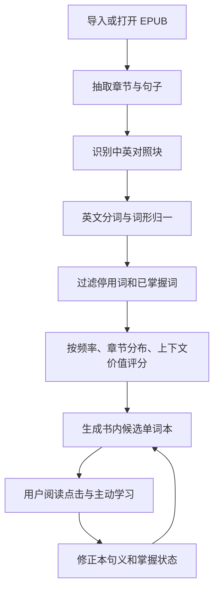
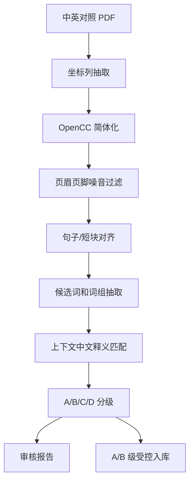

# Sentence Reader 单词本与快速查词方案

## 结论

可以做，而且值得做。但这件事不能设计成“把书里的所有英文单词导出来”。那样会得到一个很大、很乱、很快不想看的词表。

正确方向是：以这本书的句子为中心，先生成“书内单词本”，阅读时再通过点击查词、朗读和标记掌握状态不断修正它。词典只是辅助数据，书里的中英文对照才是第一解释来源。

2026-06-29 更新：Life-study/生命读经这类领域词库不能按“抽取到候选词就入库”的方式做。Genesis 中英对照 PDF 前 20 页探针已经证明版面抽取可行，但也暴露出候选噪音和低匹配率问题。因此领域词库必须先经过准确率门控：抽取、对齐、候选生成、评分、A/B/C/D 分级、审核报告、A/B 级受控入库。当前 Genesis 前 50 页和 Genesis 全书已通过规则门控；25 条 A/B 词条已写入隔离的 `reader.domain_glossary_entries` staging 表，并只在 Life-study/生命读经书籍上下文启用。`1-01创世记生命读经.epub` 也已导入 Sentence Reader，25 条 A/B 已写入该书的 `book_glossary` / `book_vocab_items`。详细施工方案见 `docs/lifestudy_vocab_pipeline_plan.md`。

## 目标

1. 打开一本英文或中英对照 EPUB 后，自动生成这本书的候选单词本。
2. 用户可以主动进入“单词本”集中学习。
3. 用户阅读正文时，可以双击英文单词快速查看：
   - 本句义
   - 对应中文句子
   - 英文原句
   - 音标或发音
   - 保存、已掌握、加入复习
4. 用户可以选中英文句子，让系统朗读句子，并显示对应中文。
5. 所有学习痕迹要跟书、句子、上下文绑定，而不是只保存一个孤立单词。

## 产品原则

### 必须坚持

- 查词卡片第一屏只显示一个核心解释：本句义。
- 本句义优先来自当前书的中文对照句，而不是外部词典的长解释。
- Life-study 领域释义只能来自中英对照证据或用户修正，不能由模型脑补。
- 只有 A/B 级领域词条可以进入前台 lookup；C/D 级只能进入审核或丢弃。
- 单词必须绑定英文句子和中文句子，否则复习价值很低。
- 用户修正过的解释优先级最高。
- 朗读使用 macOS 本地语音即可，先不做云端 TTS。
- 所有数据本地保存，离线可用。

### 暂时不要做

- 不做大而全的词典软件。
- 不把一个单词的十几个中文释义全摊出来。
- 不默认把全书每个生词都推给用户。
- 不全量跑 Life-study 全套书后直接入库。
- 不把 `god`, `life`, `word`, `earth` 这类普通高频词自动当作领域词条。
- 不把 Life-study 语境释义污染到通用词典表。
- 不在阅读正文里塞大段 AI 解释。
- 不一开始做复杂背单词游戏。

## 核心对象

### 1. Lexeme

词的标准形。

示例：

```text
surface: dispensing
lemma: dispense
part_of_speech: verb/noun
phonetic: ...
```

### 2. Occurrence

某个词在某本书、某个句子里的出现。

示例：

```text
word: dispensing
english_sentence: God is dispensing Himself into His chosen people.
chinese_sentence: 神正将祂自己分赐到祂所拣选的人里面。
chapter: 第一周 周二
position: ...
```

### 3. Book Vocabulary Item

这本书里值得学习的词条。它不是普通词典词条，而是“书内学习词条”。

它需要包含：

- 单词或短语
- 本书出现次数
- 出现章节数
- 代表英文句
- 对应中文句
- 本句义
- 是否已掌握
- 是否加入复习
- 用户修正解释

### 4. User Vocabulary Item

用户个人长期单词资产。一本书里学过的词，后面读别的书仍然可以继承掌握状态。

## 生成单词本的流程



## Life-study 领域词库门控流程

普通书内单词本可以从当前 EPUB 生成候选；Life-study 领域词库必须更严格，因为它会影响英文查词的第一解释。



分级规则：

| 等级 | 含义 | 是否可进入前台 |
| --- | --- | --- |
| A | 有强中英对照证据，中文表达清楚 | 可以 |
| B | 有较好证据，但存在轻微规范化或形态差异 | 可以，需保留来源和置信度 |
| C | 可能有价值，但需要人工确认 | 不可以 |
| D | 噪音、碎片、误切词 | 不可以 |

当前严禁：把 `god god`、`earth earth`、`says god`、页眉标题、普通高频单词直接写入正式词库。

## 词条筛选规则

不能把 every, this, from, have 这种词大量塞进单词本。候选词至少要经过一层筛选。

建议评分维度：

| 维度 | 说明 |
| --- | --- |
| 出现频率 | 高频词优先，但太常见的基础词降权 |
| 章节分布 | 多章反复出现的词更值得学 |
| 当前书术语 | ministry, economy, dispensing 这类书内关键词加权 |
| 用户行为 | 用户点过、查过、标记不认识的词加权 |
| 句子价值 | 出现在标题、纲要、重点句里的词加权 |
| 已掌握状态 | 已掌握词默认隐藏 |

第一版不要追求完美 NLP。先用简单英文分词、停用词表、词形归一和书内频率就够用。真正重要的是让用户能修正。

## 本句义设计

查词最重要的不是“这个词所有意思是什么”，而是“这个词在这一句里是什么意思”。

优先级：

1. 用户手动修正过的本句义。
2. 本书术语表。
3. 当前英文句对应的中文句。
4. 同一本书里相同短语的已确认解释。
5. ECDICT / WordNet 等外部词典的短释义。
6. 更多释义折叠在“更多”里，不进入第一屏。

2026-06-29 当前查词顺序实现：

1. 用户手动修正。
2. 当前书 `reader.book_glossary` / `reader.book_vocab_items`。
3. 如果当前书标题、hash 或文件路径明确包含 Life-study/生命读经标记，则查询 `reader.domain_glossary_entries` 中 A/B 且 active 的 Life-study 词条。
4. 通用本地词典 `reader.dictionary_entries`。

这条边界是故意收紧的：Life-study 语境词义不能污染普通英文书，也不能进入通用词典。

示例：

```text
dispensing

本句义：分赐

英文：God is dispensing Himself into His chosen people.
中文：神正将祂自己分赐到祂所拣选的人里面。

[朗读单词] [朗读句子] [加入单词本] [已掌握] [修正]
```

### 对齐质量状态

`context_meaning_zh` 只放当前中文句能支撑的短义项；术语表猜测不能直接塞进第一屏。术语表候选义项可以保留在 metadata 里，但要和当前句义分开。

| 状态 | 含义 |
| --- | --- |
| `confirmed_context_meaning` | 当前中文句直接出现短义项或认可译法。 |
| `paraphrased_context_meaning` | 当前中文句没有逐词翻译，但上下文有明确意译证据。 |
| `context_sentence_available` | 有中英对应句，但没有确认到词级短义项。 |
| `suspected_alignment_mismatch` | 术语表有候选义项，但当前中文句不支撑，疑似错配或译文省略。 |
| `missing_chinese_sentence` | 没有中文对应句。 |

产品上必须把 `suspected_alignment_mismatch` 和 `paraphrased_context_meaning` 分开。前者不要在第一屏显示短义项，后者可以显示，但要标明是上下文意译。

## 阅读时交互

### 双击单词

弹出轻量查词卡片：

- 单词
- 音标
- 本句义
- 英文原句
- 中文对照句
- 朗读单词
- 朗读句子
- 加入复习
- 已掌握
- 修正解释

卡片不能遮住太多正文。默认短小，更多词典解释折叠。

### 选中句子

显示句子工具条：

- 朗读英文句
- 显示对应中文
- 加入句子复习
- 做笔记

### 单词本页面

建议放在书籍内，而不是全局首页优先。

筛选项：

- 未掌握
- 我查过
- 高频
- 本章
- 已掌握
- 已加入复习
- 术语

每个词条显示：

- 单词
- 本句义
- 出现次数
- 代表句
- 当前掌握状态

## 主动学习模式

第一版只做最小复习，不要过度游戏化。

卡片正面：

```text
dispensing

God is dispensing Himself into His chosen people.
```

用户先自己回想，再点击显示：

```text
本句义：分赐
中文：神正将祂自己分赐到祂所拣选的人里面。
```

反馈按钮：

- 不认识
- 模糊
- 认识

根据反馈更新掌握状态和下次复习时间。

## 数据库草案

沿用现有 `reader` schema，新增几张表。

### reader.lexemes

保存标准词形和基础词典信息。

```sql
CREATE TABLE reader.lexemes (
  id TEXT PRIMARY KEY,
  lemma TEXT NOT NULL,
  surface TEXT NOT NULL,
  language TEXT NOT NULL DEFAULT 'en',
  part_of_speech TEXT,
  phonetic TEXT,
  short_definition TEXT,
  source TEXT,
  created_at TIMESTAMPTZ NOT NULL DEFAULT now(),
  updated_at TIMESTAMPTZ NOT NULL DEFAULT now()
);
```

### reader.book_word_occurrences

保存词在书内句子中的出现。

```sql
CREATE TABLE reader.book_word_occurrences (
  id TEXT PRIMARY KEY,
  book_id TEXT NOT NULL REFERENCES reader.books(id) ON DELETE CASCADE,
  sentence_id TEXT REFERENCES reader.sentences(id) ON DELETE SET NULL,
  lexeme_id TEXT REFERENCES reader.lexemes(id) ON DELETE SET NULL,
  surface TEXT NOT NULL,
  lemma TEXT,
  english_sentence TEXT NOT NULL,
  chinese_sentence TEXT,
  chapter_locator TEXT NOT NULL,
  position JSONB NOT NULL DEFAULT '{}'::jsonb,
  created_at TIMESTAMPTZ NOT NULL DEFAULT now()
);
```

### reader.book_vocab_items

保存一本书的候选学习词条。

```sql
CREATE TABLE reader.book_vocab_items (
  id TEXT PRIMARY KEY,
  book_id TEXT NOT NULL REFERENCES reader.books(id) ON DELETE CASCADE,
  lexeme_id TEXT REFERENCES reader.lexemes(id) ON DELETE SET NULL,
  surface TEXT NOT NULL,
  lemma TEXT,
  context_meaning TEXT,
  representative_sentence_en TEXT,
  representative_sentence_zh TEXT,
  occurrence_count INTEGER NOT NULL DEFAULT 0,
  chapter_count INTEGER NOT NULL DEFAULT 0,
  score DOUBLE PRECISION NOT NULL DEFAULT 0,
  status TEXT NOT NULL DEFAULT 'candidate',
  user_note TEXT,
  created_at TIMESTAMPTZ NOT NULL DEFAULT now(),
  updated_at TIMESTAMPTZ NOT NULL DEFAULT now()
);
```

`status` 建议取值：

```text
candidate, saved, reviewing, known, ignored
```

### reader.user_vocab_items

保存用户跨书的掌握状态。

```sql
CREATE TABLE reader.user_vocab_items (
  id TEXT PRIMARY KEY,
  lexeme_id TEXT REFERENCES reader.lexemes(id) ON DELETE SET NULL,
  surface TEXT NOT NULL,
  lemma TEXT,
  mastery_level INTEGER NOT NULL DEFAULT 0,
  next_review_at TIMESTAMPTZ,
  last_reviewed_at TIMESTAMPTZ,
  review_count INTEGER NOT NULL DEFAULT 0,
  created_at TIMESTAMPTZ NOT NULL DEFAULT now(),
  updated_at TIMESTAMPTZ NOT NULL DEFAULT now()
);
```

### reader.book_glossary

保存本书术语和用户修正。

```sql
CREATE TABLE reader.book_glossary (
  id TEXT PRIMARY KEY,
  book_id TEXT NOT NULL REFERENCES reader.books(id) ON DELETE CASCADE,
  term TEXT NOT NULL,
  meaning_zh TEXT NOT NULL,
  source TEXT NOT NULL DEFAULT 'user',
  confidence DOUBLE PRECISION NOT NULL DEFAULT 1,
  created_at TIMESTAMPTZ NOT NULL DEFAULT now(),
  updated_at TIMESTAMPTZ NOT NULL DEFAULT now(),
  UNIQUE (book_id, term)
);
```

### reader.lookup_events

保存用户阅读时的查词行为，用来反向优化单词本。

```sql
CREATE TABLE reader.lookup_events (
  id TEXT PRIMARY KEY,
  book_id TEXT NOT NULL REFERENCES reader.books(id) ON DELETE CASCADE,
  sentence_id TEXT REFERENCES reader.sentences(id) ON DELETE SET NULL,
  surface TEXT NOT NULL,
  lemma TEXT,
  event_kind TEXT NOT NULL,
  context JSONB NOT NULL DEFAULT '{}'::jsonb,
  created_at TIMESTAMPTZ NOT NULL DEFAULT now()
);
```

`event_kind` 建议取值：

```text
lookup, play_word, play_sentence, save, mark_known, mark_unknown, edit_meaning
```

## API 草案

```text
POST /books/{book_id}/vocab/build
GET  /books/{book_id}/vocab
GET  /books/{book_id}/lookup?word=...&sentence_id=...
POST /books/{book_id}/lookup-events
PATCH /books/{book_id}/vocab/{item_id}
POST /vocab/review/answer
GET  /vocab/review/today
```

第一版可以先不做复杂队列。导入 EPUB 后同步生成，或者用户第一次打开单词本时生成。

## 朗读方案

第一版用 macOS 本地能力：

- 单词朗读：`AVSpeechSynthesizer` 或 `NSSpeechSynthesizer`
- 句子朗读：同上
- 语速可调
- 默认英文语音
- 不缓存音频文件

后续如要更自然的声音，再考虑外部 TTS。但当前目标是查词和阅读流畅，不是做配音产品。

## 外部词库选择

推荐组合：

| 资源 | 用途 | 注意 |
| --- | --- | --- |
| ECDICT | 英汉短释义、音标、常见词基础数据 | 作为 fallback，不要直接把长释义全展示 |
| WordNet / Open English WordNet | 英文语义关系、词性 | 更适合英文解释和同义词，不适合直接给中文用户 |
| CMUdict | 英文发音数据 | 可辅助发音，不替代 TTS |
| Wiktionary / Kaikki | 更丰富释义 | 数据大且杂，第一版不建议引入 |

第一版最务实的选择是：书内中文对照 + 用户修正 + 小型 ECDICT fallback。

## 针对中英对照书的特殊能力

这本 `2026春长老-中英` 的价值在于它已经有中英对照。查词系统应该利用这个优势。

对这种书，单词解释顺序应该是：

```text
当前英文句 -> 对应中文句 -> 术语表 -> 用户修正 -> 外部词典
```

例如：

```text
economy
```

普通词典可能给出“经济、节约、体制”等解释。但在这本书里，它大概率应该优先显示“经纶”。这就是为什么不能粗暴调用普通词典。

可预置或逐步积累的书内术语：

- economy: 经纶
- dispensing: 分赐
- ministry: 职事
- fellowship: 交通
- organic: 生机的
- constitution: 构成
- Body: 身体
- consummation: 终极完成
- transformation: 变化
- expression: 彰显

这些不是全局真理，只是这本书语境下的优先解释。用户必须能改。

## 分阶段实现

### Phase 1：可用的查词和书内单词本

目标：先让用户读这本书时明显省力。

范围：

- 从当前 EPUB 抽取英文句和中文句。
- 生成书内候选词。
- 单词本页面展示候选词。
- 双击英文单词弹出查词卡片。
- 显示本句义、英文句、中文句。
- 支持朗读单词和句子。
- 支持加入复习、已掌握、忽略。

不做：

- 大型词库导入。
- 复杂间隔复习算法。
- AI 自动长解释。

验收：

- 打开 `2026春长老-中英` 后能生成候选词表。
- 双击 `economy` 显示“经纶”优先于“经济”。
- 双击 `dispensing` 显示“分赐”。
- 查词卡片能朗读单词和当前英文句。
- 标记“已掌握”后，该词默认不再出现在未掌握列表。
- 重启 App 后状态仍在。

### Phase 2：加入轻量词典 fallback

目标：当中文对照无法判断时，补一个短解释。

范围：

- 导入或内置小型 ECDICT 数据。
- 给词条补充音标、词性、短释义。
- 更多释义折叠，不进入第一屏。

验收：

- 没有中文对照的普通英文 EPUB 也能查到基础释义。
- 中文对照存在时，仍然优先显示本句义。

### Phase 3：主动复习

目标：把阅读中查过的词沉淀成长期记忆。

范围：

- 今日复习列表。
- 认识 / 模糊 / 不认识 三档反馈。
- 根据反馈调整 `mastery_level` 和 `next_review_at`。
- 支持按书复习和全局复习。

验收：

- 用户查过并保存的词会进入复习。
- 标记认识的词复习间隔变长。
- 不认识的词更快再次出现。

### Phase 4：术语表和用户修正闭环

目标：让这套系统越用越准。

范围：

- 用户可以编辑本句义。
- 用户修正进入 `book_glossary`。
- 同一本书里相同术语优先使用用户修正。
- 可导出本书术语表。

验收：

- 修改 `economy = 神圣经纶` 后，本书后续 lookup 优先显示这个解释。
- 修改只影响当前书，除非用户明确设为全局。

## 风险

### 1. 中英对照可能本身有错位

如果 EPUB 转换时句子已经串行，查词也会跟着错。这不是查词系统能完全解决的问题。

应对：

- 查词卡片必须同时展示英文句和中文句，让用户看得见证据。
- 用户能修正本句义。
- 对低置信度匹配显示“需确认”。

### 2. 自动分词会误判

例如专有名词、缩写、复合词、连字符短语都可能出错。

应对：

- 第一版允许误判，但必须方便忽略和修正。
- 对短语做白名单，不急着做复杂 NLP。

### 3. 词典噪音会毁掉体验

普通英汉词典解释太多，且经常不符合属灵书籍上下文。

应对：

- 第一屏只显示本句义。
- 词典解释折叠。
- 术语表优先于通用词典。

### 4. 单词本太大

如果第一眼看到几千个词，用户会放弃。

应对：

- 默认只显示 Top N 候选，例如前 300 个。
- 已掌握和基础词默认隐藏。
- 用“本章生词”降低压力。

## 最小可行版本

我建议第一刀这样做：

1. 给当前书生成 `book_vocab_items`，先不要引入大词库。
2. 在阅读器里支持双击英文单词查本句义。
3. 使用当前中英对照句作为解释依据。
4. 加入 macOS 本地朗读。
5. 单词本页面只做未掌握、已掌握、我查过三个筛选。
6. 用户可以修正本句义，修正结果只影响当前书。

这个版本如果做扎实，比一开始接入十个词库更有价值。

## Life-study Context Vocabulary Update

2026-06-29 已完成 Life-study Genesis 的受控词库流水线第一轮落地，并增加 no-write stage gate、单词审校包、全量词频与中文上下文报告、词组与非常用词组合审校文档。

已经完成：

- `scripts/lifestudy_context_vocab_pipeline.py`：正式 V1 提纯流水线。
- OpenCC `t2s` 简繁转换。
- 页眉、页脚、页码、重复标题过滤。
- 中英短块对齐，并输出 alignment confidence。
- A/B/C/D 分级。
- C/D 不进入 importable 文件。
- Genesis 前 50 页审核包。
- Genesis 全书 1,255 页审核包。
- `scripts/lifestudy_context_vocab_import.py`：受控导入工具，默认 dry-run，必须 `--apply` 才写库。
- Mac 端选中英文短语后保留完整短语，不再只取第一个单词。
- Reader API 支持短语 lookup，例如 `tree of life`、`God-breathed`。
- `1-01创世记生命读经.epub` 已导入为 `book_e0679064039e4e298e9faf3127b65876`。
- 25 条 A/B 已写入该书的 `reader.book_glossary` 和 `reader.book_vocab_items`。
- 导入脚本已加保护：如果已有 `source='user'` 的人工释义，重复导入不会覆盖它。
- `scripts/lifestudy_context_vocab_book_lookup_smoke.py` 验证书内查词来源和通用词典隔离。
- `scripts/lifestudy_context_vocab_review_pack.py` 生成 25 条 A/B 的人工复核包和 override 模板。
- `scripts/lifestudy_context_vocab_review_pack_smoke.py` 验证复核包不会写数据库、不会包含 C/D、没有人工确认时不能扩下一卷。
- `scripts/lifestudy_context_vocab_apply_review.py` 可以把审校后的 approve/correct/reject 安全回写；默认 dry-run，必须 `--apply` 才写库。
- `scripts/lifestudy_context_vocab_apply_review_smoke.py` 验证 pending 模板会被拒绝、dry-run 不写库、reject 会阻止扩下一卷。
- `scripts/lifestudy_context_vocab_review_ui_smoke.py` 验证 Reader API 的审校页面/API 存在、读取 25 条、pending 阶段不写库且不能扩下一卷。
- `scripts/lifestudy_context_vocab_review_suggestions.py` 生成带证据的辅助审校建议和 assistant-suggested override，但明确标记为不是人工审校。
- `scripts/lifestudy_context_vocab_review_suggestions_smoke.py` 验证建议稿不写库，且只作为 dry-run 参考。

Genesis 全书当前指标：

- A/B 可导入候选：25 条。
- 规则门控准确率估算：0.95。
- C/D 候选不会进入前台或正式导入包。
- 数据库写入：已执行，仅限 domain staging 和 Genesis book-specific A/B。

当前不能自动继续扩全套书的原因：

- 0.95 是规则门控估算，不是人工逐条审校后的最终准确率。
- 现在只证明 Genesis 这一本的链路跑通，不能推出 66 卷都可以无脑跑。
- Genesis 复核包已经生成，但 25 条仍全部是 `pending`，所以 `can_expand_next_volume=false`。
- 审校回写工具和网页审校入口已经完成，但 `reports/lifestudy_vocab_review/Genesis-review-overrides.template.json` 仍是 pending 模板。
- 可以打开 `/lifestudy/vocab/review` 逐条保存到 `Genesis-review-overrides.reviewed.json`，也可以参考 `Genesis-review-overrides.assistant-suggested.json`。把 25 条标成 approve/correct/reject 后，先 dry-run，再显式 `--apply`；然后重新生成 review pack，确认全部审完且审后精度 >=85% 后再考虑 Exodus 或下一本，不是全量跑。

下一步正确顺序：

1. 对 Genesis 25 条 A/B 做人工复核，修正明显不对的 phrase map。
2. 把修正回写到 pipeline 规则或小型人工 override 文件。
3. 选择下一本小范围验证，例如 Exodus，不直接跑全套书。
4. 每本仍先 dry-run：

```bash
.venv-reader-api/bin/python scripts/lifestudy_context_vocab_import.py \
  <NEXT_BOOK_IMPORTABLE_JSON> \
  --book-id <TARGET_BOOK_ID>
```

5. 确认无误后才允许显式执行：

```bash
.venv-reader-api/bin/python scripts/lifestudy_context_vocab_import.py \
  <NEXT_BOOK_IMPORTABLE_JSON> \
  --book-id <TARGET_BOOK_ID> \
  --apply
```

## 成功标准

这个功能成功的标准不是“词库多大”，而是：

- 用户读英文时停顿减少。
- 用户点击一个词后，看到的是当前句子的准确意思。
- 用户能把读书中真正卡住的词沉淀下来。
- 下次遇到同一个词，系统知道用户是否已经掌握。
- 单词本不会变成噪音列表。
